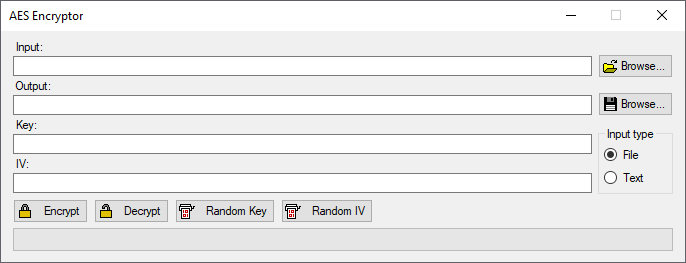
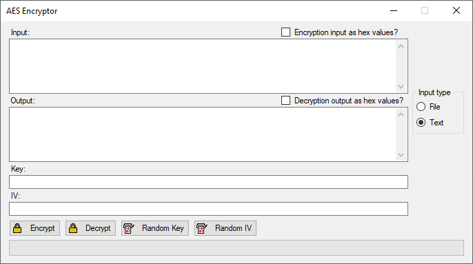

# AES Encryptor
Advanced Encryption Standard (also known as Rijndael) is a specification for data encryption.

## Functionalities
- Encrypting and decrypting files
- Encrypting and decrypting plain text
- Encrypting and decrypting hex data representation

## Technical details
The cipher uses AES in CBC mode and PKCS#7 padding.

This implementation is compliant with [FIPS 197: Advanced Encryption Standard (AES)](documents/NIST.FIPS.197.pdf) and was verified using test vectors from [NIST SP 800-38A 2001 Edition](documents/nistspecialpublication800-38a.pdf).

## Images

